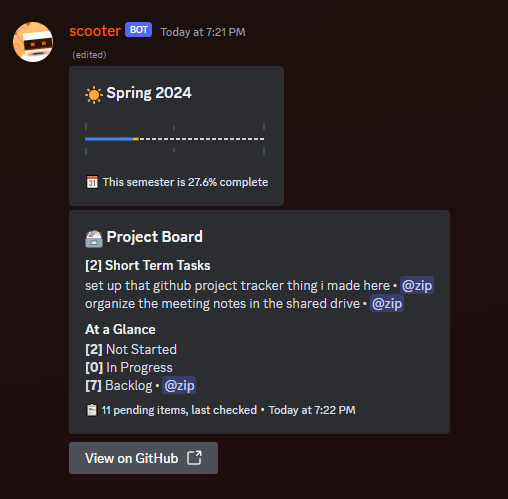

# github-projectspace-tracker



This project is meant for groups who actively communicate through Discord and use GitHub Projects as a way of tracking progress. Get a quick overview of what items are pending on your project board and who's working on what directly in Discord. You can also create todo items right in chat for things you think of on the spot.

The bot also includes a timeline feature with a configurable start and end date if your project has a deadline.

**This project was built with GitHub Organizations in mind.** Getting this to work with User Project boards is really easy though. Switch the organization GraphQL queries to user queries in `src/getIds.ts` and the rest should work fine.

## Project Setup

This project requires [Node.js](https://nodejs.org/en/) to run. This was developed using Node.js v20.10.0, but the latest LTS version should work fine. Once Node.js is installed, clone this repository and install the dependencies:

```bash
git clone https://github.com/Zyplos/github-projectspace-tracker.git
cd github-projectspace-tracker
npm install
```

Rename the `.env.example` file to `.env`.

You'll need a Discord bot token to run this project. You can get one by creating a new application in the [Discord Developer Portal](https://discord.com/developers/applications). Go to the Bot tab and enable the "Message content intent." Get a new bot token and add it to a `.env` file.

Next, you'll need a Personal access token from GitHub if you'd like to use the Project Board feature (if you'd just like to use the timeline you won't need to setup the GitHub stuff). You can create one in the [Personal access tokens](https://github.com/settings/tokens/) page under Developer Settings in your GitHub account.

If you're making a classic token, make sure to select the repo and project scopes. If you're making a fine-grained token, make sure to select write access for Projects and read access for Issues. Add the token to the `.env` file.

Next, you'll need the numeric ID of your GitHub organization's Project board. This can be found by going to your organization's Project board and looking at the URL. It should look something like this:

```
https://github.com/orgs/acme/projects/5/views/1
```

The ID is the number after `/projects/`. Add this to the `.env` file along with your organization's name.

Go to the `src` directory and rename the `config-example.ts` file to `config.ts`. This will be edited later. For now, build the project with `npm run build` and do `npm run getids` to get a list of internal IDs GitHub uses to identify various attributes in your Project board. You'll get a Project ID and an ID for the Status attribute. Add these to the `config.ts` file under `projectNodeId` and `statusFieldNodeId`, respectively. The other IDs will be used in the `config.ts` file for configuring the bot.

**Before you run the bot,** you'll need to do a bit more configuration. See the [Configuration](#configuration) section below to fill out the `config.ts` file and finish setting up the bot.

## Configuration

### A little more setup

You can find an example configuration in thie repo's `src/config-example.ts` file (which you should have renamed to `config.ts` by now).

Fill out the `labels` enum with the option IDs you got from `npm run getids`. These are the statuses you want to track in your Project board. Be sure to also give it a corresponding title in `labelTitles`.

Finally, if you're using the timeline feature, the bot expects to have some icons to build the timeline with. You can find some icons in the `icons` directory. You can also use your own icons, ideally use 18x18 icons as they'll scale perfectly down to what embeds size emotes to. Upload your icons to a Discord server your bot has access to and add the raw emote strings to the `config.ts` file.

Get the Discord channel ID that will hold the message the bot will edit to keep information up to date and add it to the `config.ts`'s `discordBoardChannelId` property. If you're unsure of how to do this, take a look at [this article](https://support.discord.com/hc/en-us/articles/206346498-Where-can-I-find-my-User-Server-Message-ID-) from Discord Support.

### Running the bot

You can now run the bot by doing `npm run start` in your terminal. By default, the bot won't do anything as it still expects a message it can edit to keep information up to date.

Send "gb;init" in the channel you configured in `config.ts` and the bot will send a message. Copy this message's ID and add it to the `config.ts`'s `discordBoardMessageId` property.

Running the bot will by default only show the timeline. You can now start configuring the bot to show your Project board. Once you have it configured to your liking, you can do `npm run start` again to start the bot. The bot will refresh the message with up to date information every midnight.

### Config Options

#### `githubUsernamesToDiscordIds`

If your GitHub collaborator also has a Discord, you can add their GitHub username and Discord ID to this object. This will allow the bot to mention them in the Project board embeds.

#### `optionPrefixes`

This is a list of prefixes the bot will listen to in chat to create new todo items. For example, typing "st#new short term task" in chat will create a new todo item with the title "short term task" with the Short Term Tasks label that you configured in the `labels` enum.

Setting it to `"default"` will add new todo items to whatever status you have configured in your Project's "Item added to project" workflow rule.

#### `detailedStatusId`

Whatever status ID you put here will display all todo items's titles in the Project board embed. Useful for todos under a category you'd like to highlight.

#### `summariedSectionIds`

The array of Status IDs listed here will only display a count of how many todo items are in that section. Useful for sections that have a lot of todos or ones you'd like to quickly glean a summary of.

#### `timelineOnly`

Setting this to `true` will only show the timeline in the bot's message and will not ping the GitHub API for Project board information. Setting to `false` will show both the timeline and the Project board information.

If you do disable the project board, you can keep the project board config options in the `config.ts` file that are there by default. The bot will ignore them.

Do not mix with the `disableTimeline` property.

#### `disableTimeline`

Setting this to `true` will disable the timeline feature and only show the Project board information.

Do not mix with the `timelineOnly` property.

#### `timelineStartDate` and `timelineEndDate`

These are expected to be Javascript date objects. Configure as needed. If you disable the timeline feature, you can leave the default values or give it dummy values.

#### `discordIcons`

The bot expects certain emotes to construct the timeline. You can use the default icons provided in the `icons` directory or use your own. The config expects emotes to be in this format: `<:emoteName:emoteId>`
